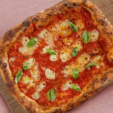

# Margherita

### Ingredients:
- Pizza Dough
- Tomato Sauce
- Fresh Mozzarella Cheese
- Fresh Basil Leaves
- Extra Virgin Olive Oil
- Salt

---

--- 

Donec tincidunt nulla a faucibus lacinia. Maecenas bibendum fermentum tellus id pulvinar. Praesent fermentum luctus risus, eleifend iaculis ante finibus non. Ut hendrerit lacus posuere tellus tincidunt, non venenatis est porta. Nunc vitae turpis sollicitudin, aliquam nisl quis, lacinia odio. Mauris vel consequat ligula, a congue diam. Nunc vitae condimentum orci. Donec rhoncus viverra eros ac accumsan. In pretium posuere fringilla. Duis commodo urna eget tincidunt dictum.